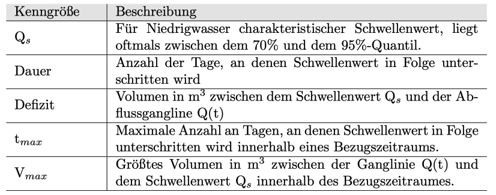
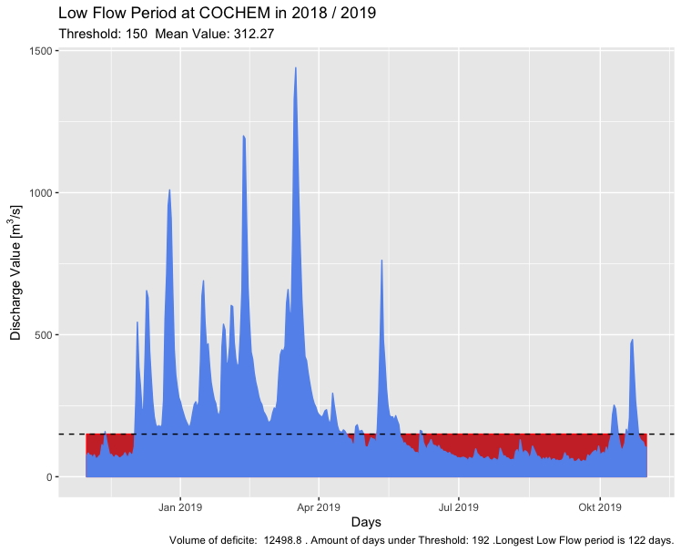
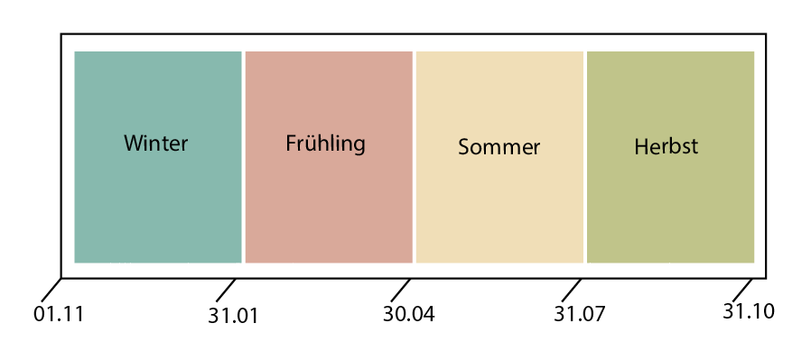

#### Die Abflussganglinie

Niedrigwasseranalysen werden nicht ausschließlich anhand von Ablussdaten durchgeführt. Um Aussagen über Trends der Niedrigwasserkennwerte zu treffen, oder die Ergebnisse vergleichbar zu machen, werden die Messgrößen auf die Zeit bezogen ((Bernhardt et al. (1993)). Die Darstellung der Abflussmessungen in Abhängigkeit von der Zeit wird als Abflussganglinie bezeichnet (Fohrer et al. (2016)).
Alle Analysen in dieser Auswertung beziehen sich auf das hydrologische Jahr gemäß der DIN 4049-1. Es beginnt am 01. November und endet am 31. Oktober des Folgejahres, um auch Niederschläge zu erfassen, die im Herbst des Vorjahres gefallen sind und als Grundwasser, Schnee oder Eis im Einzugsgebiet gespeichert sind und erst in Folgejahr abflusswirksam werden (GERICS (2013), Riedel et al. (2017)).

In dieser Arbeit werden sowohl schwellenwertbasierte,als auch nicht schwellenwertbasierte Niedrigwasserkennwerte berechnet.

#### Schwellenwertbasierte Niedrigwasseranalyse 

Für schwellenwertbasierte Niedrigwasserkennwerte bietet es sich an, den Schwellenwert quantilbasiert festzulegen, um eine bessere Vergleichbarkeit zwischen Flüssen verschiedener Größe zu garantieren. Üblicherweise liegt der Schwellenwert Qs für Niedrigwasser in dem Bereich zwischen dem 70% und dem 95% -Quantil (Oestermann and Mudersbach (2021)).Das Quantil Qx wird auf der Grundlage des gesamten Datensatzes einer Station berechnet. Der Schwellenwert Qx bezeichnet den Abfluss, der an X% der Tage innerhalb des Bezugszeitraumes entweder erreicht oder überschritten wurde (Laaha and Blöschl (2006)). In dieser Arbeit wurde das 90%-Quantil als Schwellenwert gewählt, um Niedrigwasser zu defineiren. Diese Analyseumgebung  bietet die Möglichkeit auch andere Quantile zwischen 70% und 95% als Schwellenwert auszuwäheln. 
Anhand des für Niedrigwasser charakteristischen Schwellenwertes (Qs), lässt sich die Niedrigwasserperiode definieren. Sie bezeichnet einen Zeitabschnitt, mehrerer zusammenhängender Tage an denen im Gewässer die täglichen Abflusswerte den Schwellenwert unterschreiten und lässt sich anhand von drei Größen beschreiben.Der Dauer, dem Defizit und dem Schwellenwert. Qs (Oestermann and Mudersbach (2021)). Die Dauer umfasst die Anzahl der Tage, an denen der Schwellenwert in Folge unterschritten wird. Das Defizit beschreibt das Volumen zwischen dem Schwellenwert Qs und der Abflussganglinie Q(t). Weitere Größen die eine bestimmte Niedrigwasserperiode charakterisieren sind: tmax , Vmax und sum(V) (Bernhardt et al. (1993)).  Zusätzlich wird auf dieser Website Die Tabelle liefert eine knappe Zusammenfassung aller Größen, die eine Niedrigwasserperiode beschreiben:

     

Außerdem wird auf dieser Website auch die Summe der Tage betrachtet, an denen der Schwellenwert Qs unterschritten wird.
Diese Größen lassen sich mit dieser WebApp oder mit dem R-Paket nachvollziehbar visualisieren: 

     

####  Nicht schwellenwertbasierte Niedrigwasseranalyse 

Der Niedrigwasserabflusswert NMxQ [m^3/s] beschreibt das niedrigste arithmetische Mittel  von x aufeinanderfolgenden Tagen innerhalb eines festgelegten Zeitabschnitts (ZA). Diese Größe ist in erster Linie geeignet, um Entnahmen und Einleitungen abzuschätzen, wobei der Einfluss kurzfrister Änderungen mit abnehmenden Werten für x steigt. Umso höher x gewählt wir, desto höher ist der Einfluss des Mittelwassers (Maniak (2016)). Für die flächendeckende Analyse werden für x die Werte 7,14 und 60 angenommen. 

Der Niedrigwasserkennwert MNQ ist der Niedrigste Abfluss innerhalb eines Zeitabschnittes (ZA). In dieser Auswertung wird für jeden Zeitabschnitt innerhalb eines Bezugszeitraumes der Niedrigste Wert, als Grundlage für die Trendanalyse ermittelt. MQ bezeichnet das arithmetische Mittel der Abflussmesswerte eines Zeitabschnitts (ZA). 

Extreme Niedrigwassersituationen treten oftmals saisonal auf. Es treten innerhalb der verschiedenen Jahreszeiten oftmals unterschiedlich starke oder gegenläufige Tendenzen auf. Um jahreszeitliche Trends und Charakteristka des Abflussregimes zu verstehen reicht demnach die ausschließliche Betrachtung der Niedrigwasserkennwerte innerhalb des hydrologischen Jahres nicht aus. Um die starke Saisonalität des Niedrigwassers abzubilden werden in dieser Auswertung neben dem hydrologischen Jahr auch die Niedrigwasserkennwerte der einzelnen Jahreszeiten berechnet. So werden NMxQ, MNQ und MQ auf LowFlowAnalysis.de für fünf Zeitabschnitte (ZA) berechnet:

     

##### Quellen

Bernhardt, H., W. Bischofsberger, W. Brenner, H. Erchinger H.Bretschneider, A. Grohmann, P. Groth, W. Kresser, et al. 1993. Taschenbuch Der Wasserwirtschaft. H. Bretschneider; K. Lecher; M. Schmidt.

GERICS. 2013. “Hydrologisches Jahr.” GERICS Climate Service Center Germany. https://www.climate-service-center.de/products_and_publications/publications/detail/063022/index.php.de#:~:text=Das%20hydrologische%20Jahr%20(auch%20Abflussjahr,am%2031.%20Oktober%20des%20Folgejahres.

Laaha, Gregor, and Günter Blöschl. 2006. Flächendeckende Bestimmung von Niederwasserkenngrößen in Österreich. na.

Maniak, Ulrich. 2016. “Einführung Hydrologie Und Wasserwirtschaft.” In Hydrologie Und Wasserwirtschaft, 1–19. Springer.

Oestermann, Florian, and Christoph Mudersbach. 2021. “Langjährige Trends Der Niedrigwasserkennwerte in Deutschland.” Hydrologie Und Wasserbewirtschaftung 65: 137–55.

Riedel, Thomas, Christoph Nolte, Tim aus der Beek, and Jana Liedtke. 2017. “Hydrologisches Jahr.” Ministerium für Umwelt, Landwirtschaft, Natur- und Varbraucherschutz des Landes Nordrhein-Westfalen. https://www.flussgebiete.nrw.de/hydrologisches-jahr-3812.

