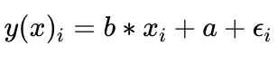
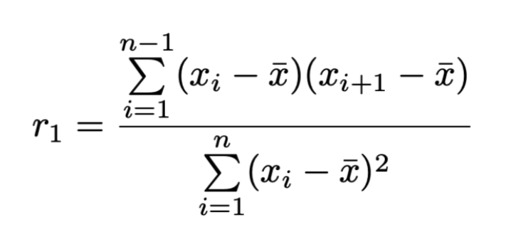

#### Die Trendanalyse 
Die Ermittlung eines Trends erfolgt in dieser Arbeit grundsätzlich nach zwei Ansätzen, der linearen Regression (R Core Team (2021)) und der Trendermittlung mit dem Sen-Slope Estimator (Bronaugh and Pacific Climate Impacts Consortium (2019)). Letzterer ist weniger anfällig gegenüber Ausreißern und liefert demnach robustere Ergebnisse (Sen (1968)). Ziel der Trendanalyse ist die Fragestellung, ob das Eintreten der Zielvariable y durch die Einflussvariable x in einem linearen Modell erklärt werden kann (Frost (2018)). In dem Kontext dieser Arbeit ist die abhängige Variable y der täglich gemittelte Abfluss eines Flusses [m^3/s] und die unabhängige Variable x ist die Zeit in Tagen.

#### Die Lineare Regression
 
Man wählt eine lineare Funktion als Modell, in R mit Hilfe von (R Core Team (2021)) und geht davon aus, dass y linear von x abhängig ist: 

     

Die Fehlervariable *epsilon* beschreibt die zufälligen Fehler. Visuell beschreibt *epsilon* den Abstand der Messpunkte zu der Geraden. Man passt das Modell an die Gerade an, indem man das Quadrat dieser Fehler minimiert (Frost (2018)). Für die Gültigkeit des linearen Modells müssen jedoch einige Grundannahmen getroffen werden: die Konstante Varianz, also dass kein Muster in den Residuen vorliegt, die Normalverteilung der Residuen und dass die Residuen unabhängig sind. Ein wesentliches Problem der Analyse von hydrologischen oder klimatischen Zeitreihen ist, dass die Daten einer logischen Ordnung unterliegen müssen damit sie interpretierbar sind. Das bedeutet, dass die Werte untereinander korrelliert, also die Residuen nicht unabhängig sind. Diese sogenannte Autokorrelation gibt an, wie stark sich die Werte, in Abhängigkeit der Zeit, untereinander beeinflussen (Huxol and Leibundgut (2007)). 

Diese Beobachtungen zeigen, dass die Aussagekraft des, durch die lineare Regression berechneten, Modells eingeschränkt ist, weswegen in dieser Analyse ein zweiter Ansatz gewählt wurde.

#### Zyp

Die Trendermittlung mit dem R-Paket "'zyp"' unter Anwendung der "'Yuepilon"'-Methode (Bronaugh and Pacific Climate Impacts Consortium (2019)) erfolgt in 4 Schritten:

- Ermittlung und Entfernung des Trends (Sen-Slope Estimator)
- Ermittlung und Entfernung der Autokorrelation
- Hinzufügen des Trends 
- Ermittlung der Signifikanz: Mann-Kendall Test

Der Ansatz nutzt den Mann-Kendall Test, um die gegebene Messreihe auf einen monotonen, linearen Trend zu prüfen. Die Nullhypothese H0 des Tests ist, dass kein Trend vorliegt. Dem Gegenüber steht die Alternativhypothese HA, dass ein Trend vorliegt. Der Signifikanzwert liefert uns eine Aussage darüber, wie wahrscheinlich es ist, dass die Nullhypothese H0 zutrifft unter Berücksichtigung der vorliegenden Daten. Das Konzept des Signifikanztests ist das Einsetzen der Daten als Evidenz. Per Konvention wird in dieser Arbeit das Signifikanzniveau *alpha*=0,05 angenommen, demnach wird die Nullhypothese H0 verworfen, sobald p > 0,05. Für jeden p-Wert, der so groß ist wie *alpha*, oder *alpha* unterschreitet, wird der vorliegende Trend in dieser Analyse als signifikant bezeichnet. 

Da es sich um einen nichtparametrischen Test handelt, wird keine bestimmte Verteilung der Daten vorausgesetzt (Goswami (2017)). Dieser Test ist ein verbreiteter Ansatz, um hydrologische oder klimatische Zeitreihen auszuwerten, weswegen er in vielen anderen Arbeiten in einem vergleichbaren Kontext verwendet wird (siehe:Oestermann and Mudersbach (2021), Burns, Klaus, and McHale (2007), Chim et al. (2021), Birsan et al. (2005)). 
Da der Mann-Kendall Test eher bei kürzeren Zeitreihen zu verzerrten Ergebnissen führt, ist er bei dem Umfang der vorliegenden Messreihen sinnvoll einzusetzen. Der Mann-Kendall Test ist nicht für Datensätze mit starken Periodizitäten geeignet (Goswami (2017)).  Außerdem kann der Test nicht auf autokorrelierte Daten angewendet werden, da sonst die Ablehnungsrate der Nullhypothese bei gleichbleibendem Signifikanzniveau (5%) erhöht wird (Bayazit and Önöz (2007), Storch (1999)). Dieser Fehler ist der Fehler erster Art. Nach Yue et al. (2002) führt auch eine negative Autokorrelation zu einer Beeinflussung des Trends. Sie führt zu einem erhöhten Fehler zweiter Art, also die Wahrscheinlichkeit einen Trend zu unterschätzen, weswegen signifikante Trends nicht erkannt werden.
Wie unter unter dem Abschnitt der Linearen Regression beschrieben, sind einzelne Werte von Zeitreihen untereinander abhängig. Aus diesem Grund wird die Nullhypothese für diese Daten nicht zwangsläufig wegen eines Trends abgelehnt. Die Ablehnung kann auch auf die Autokorrelation der Daten zurückzuführen sein (Bürger (2017)). Ein Weg, um die erhöhte Ablehnungsrate der Nullhypothese zu vermeiden, ist die ausschließliche Anwendung des Tests, auf Daten die voneinander unabhängig gemacht wurden. Prewhitening korrigiert die Autokorrelation (Kulkarni and Storch (1995)).
Da sowohl für die Lineare Regression, als auch für den Mann-Kendall Test die Daten unkorreliert vorliegen müssen, ist das Prewhitening für beide Verfahren anwendbar. Für das Prewhitening muss die Grundannahme gegeben sein, dass die vorliegende Zeitreihe die Summe aus einem vorherrschendem Trend und einem durch Autokorrelation erzeugtem Rauschen ist (Zhang and Zwiers (2004)).

Um die Autokorrelation zu bestimmen, überprüft man die Abhängigkeit eines Wertes von dem Wert des Zeitschritts davor. Der Zeitabstand zwischen den einzelnen Werten ist ein "Lag". Lag-1, die Autokorrelation 1.Grades AR(1), beschreibt die Abhängigkeit des Wertes von dem vorherige Wert (Huxol and Leibundgut (2007)).

Da Prewhitening neben der Entfernung der Autokorrelation auch zu einer Minderung der Steigung des Trends führt  (Bayazit and Önöz (2007), Storch (1999)), entwickelten Yue et al. (2002) den Ansatz der „trend-free-pre-whitening procedure“ (TFPW), der auch in dieser Analyse verwendet wurde.

Dabei wird erst der Trend nach der Theil-Sen Schätzung ermittelt 
(Bronaugh and Pacific Climate Impacts Consortium (2019), Sen (1968)). Ist er nahezu Null, erfolgt keine Trendanalyse. Andernfalls wird der Trend als linear angenommen und aus der Zeitreihe eliminiert (Bronaugh and Pacific Climate Impacts Consortium (2019)). Der Sen-Slope basiert auf der Verwendung des Medians, weswegen er robuster gegenüber Ausreißern in der Datenreihe ist, als die Lineare Regression. Wegen der auftretenden Extremereignisse in hydrologischen Zeitreihen, ist ein robuster Ansatz für diesen Datensatz sinnvoll. Bei dem Sen-Slope-Ansatz wird für jedes mögliche Wertepaar der Zeitreihe die Steigung ermittelt. Der Schätzer des Trends der gesamten Zeitreihe ist der Median der Steigungen der einzelnen Wertepaare (Huxol and Leibundgut (2007)).
Auf Grundlage der überarbeiteten Zeitreihe wird im Anschluss der Autokorrelationskoeffizient erster Ordnung berechntet, mit dem das Prewhitening durchgeführt wird (Bronaugh and Pacific Climate Impacts Consortium (2019)): 

     

Anhand von Stichproben wurde erkenntlich, dass bei klimatologischen und hydrologischen Datensätzen in erster Linie starke Autokorrelationen ersten Grades auftreten (Huxol and Leibundgut (2007)). Der Trend und die Residuen werden im nächsten Schritt zusammengetragen, um mit Hilfe des Mann-Kendall-Tests die Signifikanz des Trends bewertet zu können. Die Werte, die in die Berechnung der Signifikanz eingehen, werden in dem Ansatz des zyp-Pakets durch Division durch (1-AR(1)) wieder aufgefüllt, was gegenüber der ursprünglichen Methode von Yue und Pilon empirisch bessere Ergebnisse liefert (Bronaugh and Pacific Climate Impacts Consortium (2019)).

#### Kontroverse: Zyp oder Lineare Regression?

In dieser Arbeit wurden beide Ansätze verwendet, um einen direkten Vergleich zu ermöglichen. Wegen einer geringeren Varianz liefert der Sen-Slope Ansatz bei nicht normal-verteilten Datensätzen bessere Ergebnisse  (Huxol and Leibundgut (2007)). Darüber hinaus ist der Ansatz robuster gegenüber Ausreißern (Storch (1999),Bayazit and Önöz (2007)).
Bei normalverteilten Daten kann die Schätzung nach der Methode der kleinsten Quadrate, leicht bessere Ergebnisse liefern (Huxol and Leibundgut (2007)) . Wegen der Autokorrelation und des teilweise auftretenden Musters der Residuen, ist die Aussagekraft des Linearen Modells jedoch eingeschränkt. Da vor der Berechnung des linearen Modells durch die lineare Regression die Autokorrelation im Gegensatz zu dem "'zyp"'-Ansatz nicht durch das Prewhitening entfernt wurde. 

Die Wahl der Prewhitening-Methode beeinflusst sowohl die statistische Signifikanz als auch den Wert der Steigung, weswegen dieser Ansatz weiter untersucht (Yue and Wang (2002)) und heute kontrovers diskutiert wird (Bayazit and Önöz (2007)). Das Ergebnis dieser Untersuchung war, dass bei langen Zeitreihen (n > 50) und starkem Trend die Autokorrelation keinen signifikanten Einfluss auf das Ergebnis des Mann-Kendall Tests ausübt. Demnach empfehlen Yue & Wang (2002) bei einer ausreichend großen Stichprobengröße und einem ausreichend starkem Trend, den MK-Test auf die Originaldaten anzuwenden, da das Ergebnis unter diesen Voraussetzungen nicht signifikant durch die Autokorrelation beeinflusst wird. Dieser Ansatz solle verhindern, den vorliegenden Trend durch das PreWhitening zu eliminieren. 

 Die Beantwortung der Frage, ob ein ausreichender Trend vorliegt ist sehr fehleranfällig, da es für Laien oftmals nicht erkennbar ist, ob ein beobachtbarer Trend lediglich durch Rauschen entsteht (Zhang and Zwiers (2004)).
 Da TFPW-Ansätze im Vergleich mit anderen Methoden häufiger zu signifikanten Ergebnissen kommen, sollten die Ergebnisse dieser Ansätze hinterfragt werden und ausschließlich mit einer Anpassung des Signifikanzniveaus genutzt werden. Die default-option des "'zyp"'-Pakets (Bronaugh and Pacific Climate Impacts Consortium (2019)) nutzt eine "'variance-inflation"' die sich wesentlich von dem ursprünglichen Yue et al.2002 Ansatz unterscheidet und auch für diese Analyse genutzt wird.  Bei einem Signifikanztest sollte darauf geachtet werden, dass der Fehler erster Art dem Signifikanzniveau entspricht. Mit Hilfe eines Monte-Carlo-Ansatzes konnte gezeigt werden, dass bei TFPW-Ansätzen mit zunehmender Autokorrelation hohe Typ I -Fehlerraten auftreten (Bürger (2017)).
 Unter Vorbehalt dieser Kontroverse erfolgt die Ergebnisinterpretation und Diskussion der ermittelten Trends. Für die Einordnung eines mit dieser Website erzeugten Trends ist es ratsam, auch Faktoren der deskriptiven Statistik miteinzubeziehen. Dafür bietet diese WebApp die Visualisierung des Datensatzes in verschiedenen Formen.

#### Der Pettitt-Test

In der Trendanalyse von Zeitreihen ist das Ziel langfristige Trends zu ermitteln. Kurzfristige Änderungen (Sprungstellen) können den Trend jedoch ebenfalls stark beeinflussen (Oestermann and Mudersbach (2021)), weswegen die Detektion einer Sprungstelle mit Hilfe des Pettitt-Tests (Pettitt (1979)) auf dieser Website für jeden  Datensatz möglich ist. Dabei ist es möglich die Zeitspanne des gesamten Datensatzes oder eines hydrologischen Jahres zu wählen. Der Pettitt-Test wird auf einem Signifikanzniveau von 5% getestet und gibt die Position der Sprungstelle, sowie die Signifkanz wieder (Pohlert (2020)). Von einer Homogeniserung aller Sprungstellen wurde in dieser Auswertung allerdings abgesehen. Auch wenn einzelne Sprungstellen den langjährigen Trend stark überprägen können, können diese auch natürlich auftreten und so Teil des natürlichen Abflussregimes sein. Das Ziel dieser Analyse ist den Trend dieses Regimes zu ermitteln, weswegen das Eliminieren von Sprungstellen zu einem Informationsverlust führen könnte. Für eine vollständige Analyse, empfiehlt es sich die maximale Anzahl einzelner Stationen mit dieser Website auszuwerten und die Sprungstellen und somit den Trend anhand von weitergehenden Informationen über den jeweiligen Pegel zu bewerten. Darüber hinaus sollten alle Ergebnisse großflächiger Trendanalysen unter dem Vorbehalt dieser möglichen Fehlerquellen bewertet werden. 

##### Quellen

Bayazit, M, and BJHSJ Önöz. 2007. “To Prewhiten or Not to Prewhiten in Trend Analysis?” Hydrological Sciences Journal 52 (4): 611–24.

Birsan, Marius-Victor, Peter Molnar, Paolo Burlando, and Martin Pfaundler. 2005. “Streamflow Trends in Switzerland.” Journal of Hydrology 314 (1-4): 312–29.

Bronaugh, David, and Arelia Werner for the Pacific Climate Impacts Consortium. 2019. Zyp: Zhang + Yue-Pilon Trends Package. https://CRAN.R-project.org/package=zyp.

Burns, Douglas A, Julian Klaus, and Michael R McHale. 2007. “Recent Climate Trends and Implications for Water Resources in the Catskill Mountain Region, New York, Usa.” Journal of Hydrology 336 (1-2): 155–70.

Bürger, Gerd. 2017. “On Trend Detection.” Hydrological Processes 31 (22): 4039–42.

Chim, Kosal, Jon Tunnicliffe, Asaad Shamseldin, and Kakkada Chan. 2021. “Identifying Future Climate Change and Drought Detection Using Canesm2 in the Upper Siem Reap River, Cambodia.” Dynamics of Atmospheres and Oceans 94: 101182.

Frost, Irasianty. 2018. “Einfache Lineare Regression.” In Einfache Lineare Regression: Die Grundlage Für Komplexe Regressionsmodelle Verstehen, 3–8. Wiesbaden: Springer Fachmedien Wiesbaden. https://doi.org/10.1007/978-3-658-19732-2_2.

Goswami, Bedartha. 2017. “Mann-Kendall Test (Mkt).” https://up-rs-esp.github.io/mkt/.

Huxol, Stephan, and Ch Leibundgut. 2007. “Institut Für Hydrologie Der Albert-Ludwigs-Universität Freiburg I. Br.”

Kulkarni, Ashwini, and Hans von Storch. 1995. “Monte Carlo Experiments on the Effect of Serial Correlation on the Mann-Kendall Test of Trend.” Meteorologische Zeitschrift 4 (2): 82–85.

Oestermann, Florian, and Christoph Mudersbach. 2021. “Langjährige Trends Der Niedrigwasserkennwerte in Deutschland.” Hydrologie Und Wasserbewirtschaftung 65: 137–55.

Pettitt, Anthony N. 1979. “A Non-Parametric Approach to the Change-Point Problem.” Journal of the Royal Statistical Society: Series C (Applied Statistics) 28 (2): 126–35.

Pohlert, Thorsten. 2020. Trend: Non-Parametric Trend Tests and Change-Point Detection. https://CRAN.R-project.org/package=trend.

R Core Team. 2021. R: A Language and Environment for Statistical Computing. Vienna, Austria: R Foundation for Statistical Computing. https://www.R-project.org/.

Sen, Pranab Kumar. 1968. “Estimates of the Regression Coefficient Based on Kendall’s Tau.” Journal of the American Statistical Association 63 (324): 1379–89.

Storch, Hans von. 1999. “Misuses of Statistical Analysis in Climate Research.” In Analysis of Climate Variability, 11–26. Springer.

Yue, Sheng, Paul Pilon, and George Cavadias. 2002. “Power of the Mann–Kendall and Spearman’s Rho Tests for Detecting Monotonic Trends in Hydrological Series.” Journal of Hydrology 259 (1-4): 254–71.

Yue, Sheng, and Chun Yuan Wang. 2002. “Applicability of Prewhitening to Eliminate the Influence of Serial Correlation on the Mann-Kendall Test.” Water Resources Research 38 (6): 4–1.

Zhang, X., and F. W. Zwiers. 2004. “Comment on ‘“Applicability of Prewhitening to Eliminate the Influence of Serial Correlation on the Mann-Kendall Test”’ by Sheng Yue and Chun Yuan Wang.” Water Resour. Res., 40, W03805.
