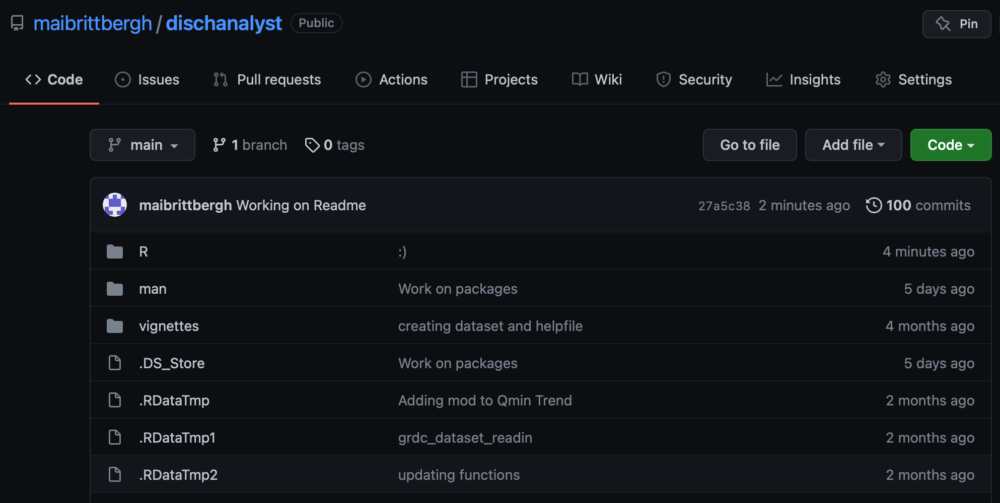
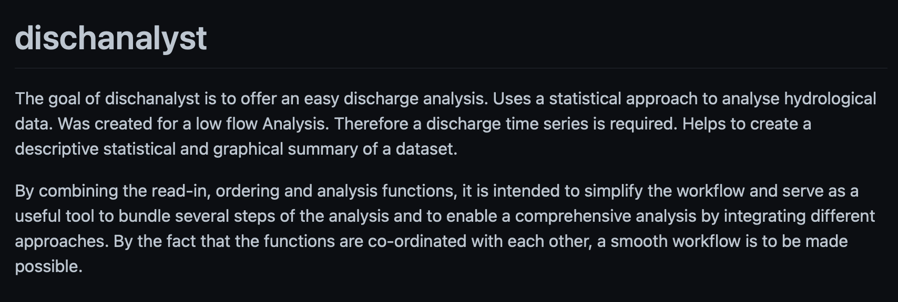
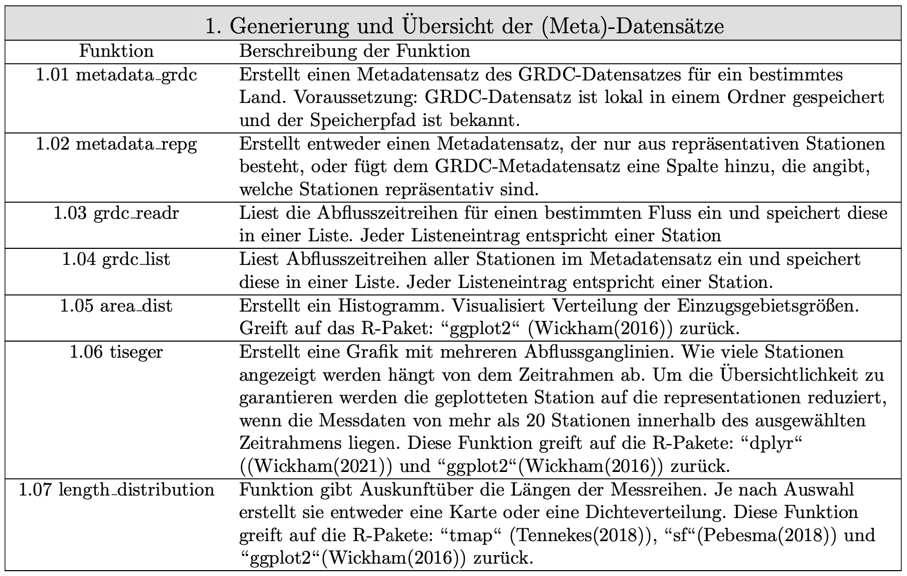
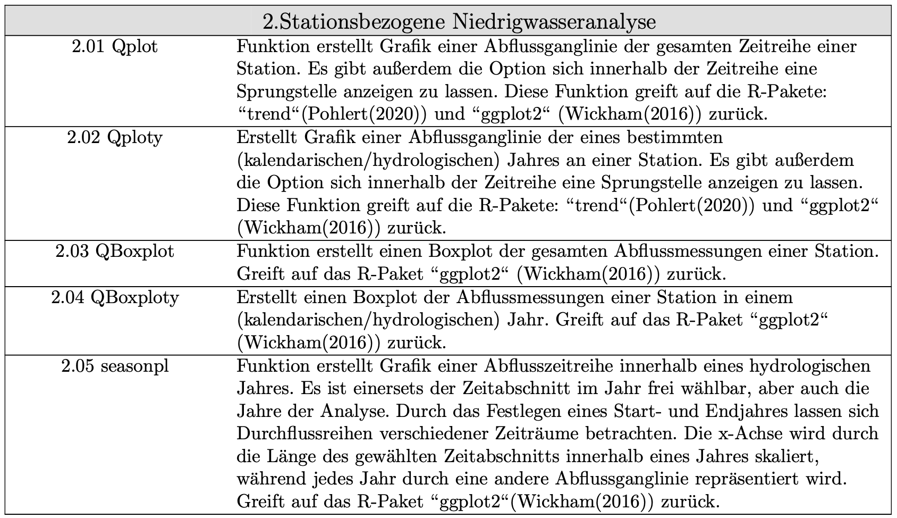
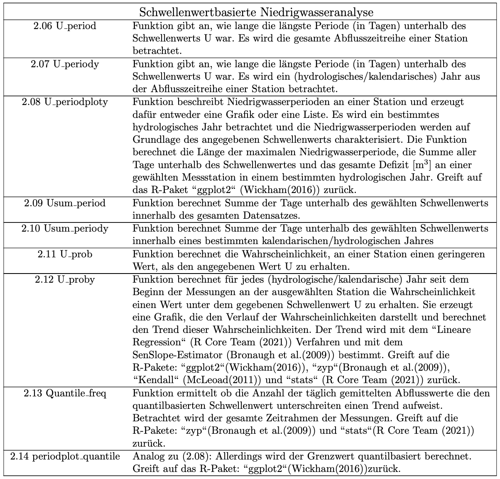
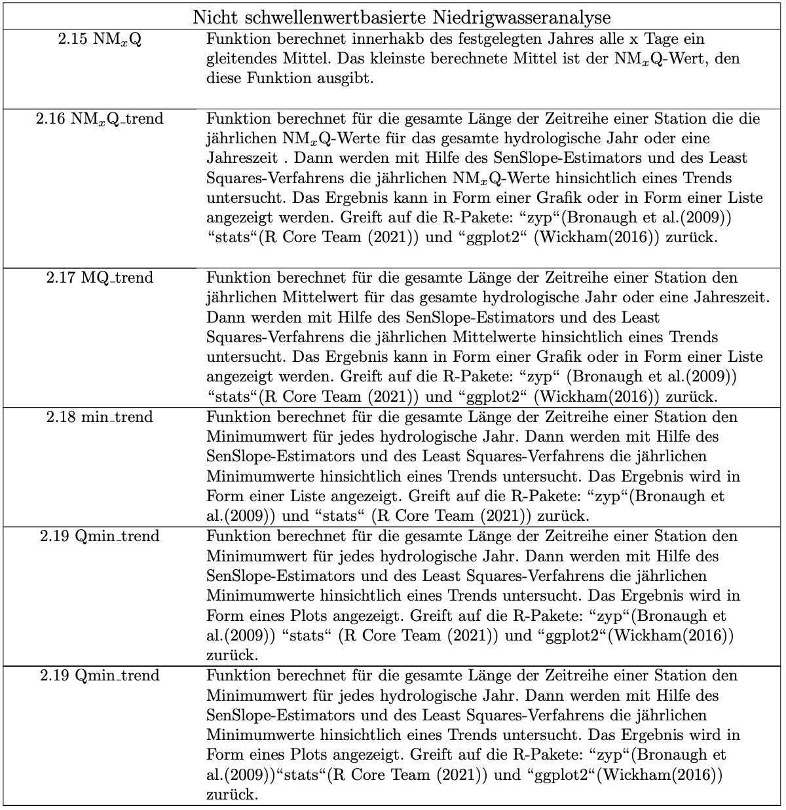
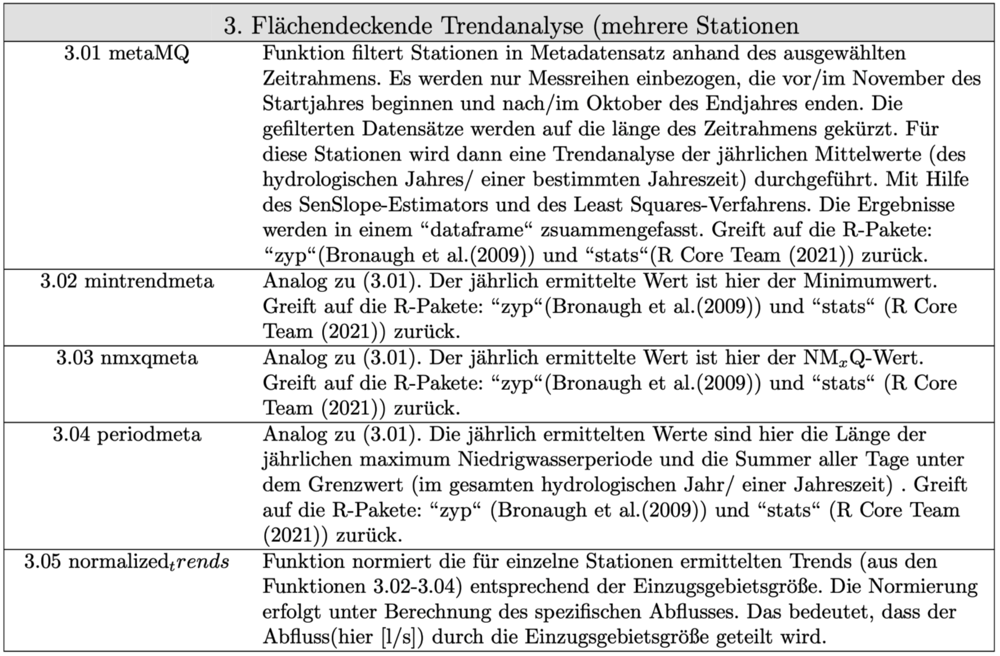

#### Das R-Paket: Dischanalyst

####  Zielsetzung und Zweck
</p>Das R-Paket *dischanalyst* wurde im Rahmen dieser Arbeit für die statistische Niedrigwasseranalyse des GRDC-Datensatzes  (GRDC (2021)) entwickelt und dient der Auswertung von Zeitreihen. Durch die Kombination der Einlese- der Ordnungs- und der Analysefunktionen, soll es denn Arbeitsablauf vereinfachen und als sinnvolles Werkzeug dienen, mehrere Schritte der Arbeit zu bündeln und durch die Integration verschiedener Ansätze eine umfangreiche Analyse ermöglichen.</p>

#### Nutzung und Weiterentwicklung 
</p>
Das Paket kann über GitHub runtergeladen, eingesehen, genutzt und weiterentwickelt werden: </p>

**https://github.com/maibrittbergh/dischanalyst**
``` r
# install.packages("devtools")
devtools::install_github("maibrittbergh/dischanalyst")
```
<center>
    
</center>

<center>
    
</center>

</p>*dischanalyst* kann auf den GRDC-Datensatz oder auf hydrologische- und klimatologische Zeitreihen angewendet werden, die dem Aufbau der GRDC-Abflussmessreihen entsprechen. Demnach muss für jeden täglichen Messwert einer Messstation ein Datum (YYYY-MM-DD) vorliegen. Sobald ein Datensatz dieser Struktur vorliegt, kann dieser mit Hilfe von *dischanalyst* eingelesen, strukturiert und analysiert werden. 


#### Struktur und Aufbau 

Der Aufbau des Pakets entspricht dem Aufbau dieser WebAnwendung, demnach ist auch mit *dischanalyst* sowohl eine Stationsbezogene Analyse, als auch eine flächendeckende (deutschlandweite) Analyse der Messreihen möglich. So enthält das Paket: </p>

1. Funktionen zum **Einlesen und Gliedern** des GRDC-Datensatzes
2. Funktionen für die Statistische **Analyse einzelner Messreihen**. Dazu zählen deskriptive Analysen, schwellenwertbasierte- und nicht schwellenwertbasierte Niedrigwasseranalyse und Trendermittlungen
3. Funktionen, um **deutschlandweite Niedrigwassertrends** zu generieren und zu verstehen

#### 1. Funktionen zum Einlesen und Gliedern des GRDC-Datensatzes

<center>
    
</center>

#### 2. Stationsbezogene Niedrigwasseranalyse 

<center>
    
</center>

##### 2.1 Schwellenwertbasierte Niedrigwasserkennwerte

<center>
    
</center>

##### 2.2 Nicht schwellenwertbasierte Niedrigwasserkennwerte
<center>
    
</center>

#### 3. Flächendeckende Niedrigwasseranalyse 

<center>
    
</center>

</p>
Da das Paket mit der Zielstellung einer "Niedrigwasseranalyse für Deutschland" entwickelt wurde, gibt es wenige Funktionen, die ausschließlich für die deutschlandweite Analyse anwendbar sind und auch die teilweise  in die Analyse integrierten *repräsentativen Stationen* liegen ausschließlich für Deutschland vor. Von diesen Einschränkungen abgesehen ist eine umfängliche deskriptive und eine Niedrigwasseranalyse mit dem R-Paket auch für jedes andere Land möglich, für das Daten vorliegen. 
</p>

</p>
Alle auf dieser Anwendung präsentierten Ergebnisse wurden unter Nutzung des R-Pakets *dischanalyst* erzeugt, weswegen die unter **Methodik** diskutierten und erläuterten Statistischen Ansätze für das Paket und damit auch für diese Website gelten. 
</p>


##### Quellen


Bronaugh, David, and Arelia Werner for the Pacific Climate Impacts Consortium. 2019. Zyp: Zhang + Yue-Pilon Trends Package. https://CRAN.R-project.org/package=zyp.

GRDC. 2021. “GRDC Data Download.” The Global Runoff Data Centre, 56068 Koblenz, Germany. https://www.bafg.de/GRDC/EN/02_srvcs/21_tmsrs/210_prtl/tou.html?nn=2862854.

Pebesma, Edzer. 2018. “Simple Features for R: Standardized Support for Spatial Vector Data.” The R Journal 10 (1): 439–46. https://doi.org/10.32614/RJ-2018-009.

R Core Team. 2021. R: A Language and Environment for Statistical Computing. Vienna, Austria: R Foundation for Statistical Computing. https://www.R-project.org/.

Tennekes, Martijn. 2018. “tmap: Thematic Maps in R.” Journal of Statistical Software 84 (6): 1–39. https://doi.org/10.18637/jss.v084.i06.

Wickham, Hadley. 2016. Ggplot2: Elegant Graphics for Data Analysis. Springer-Verlag New York. https://ggplot2.tidyverse.org.

Wickham, Hadley, Romain François, Lionel Henry, and Kirill Müller. 2021. Dplyr: A Grammar of Data Manipulation. https://CRAN.R-project.org/package=dplyr.


 
