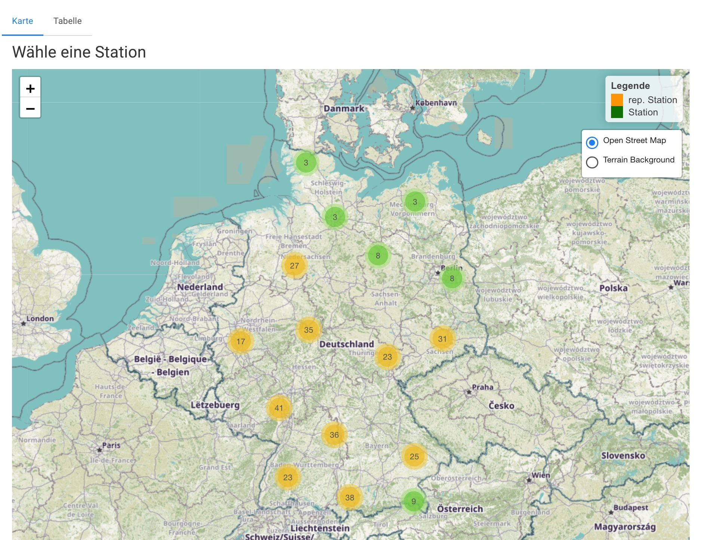
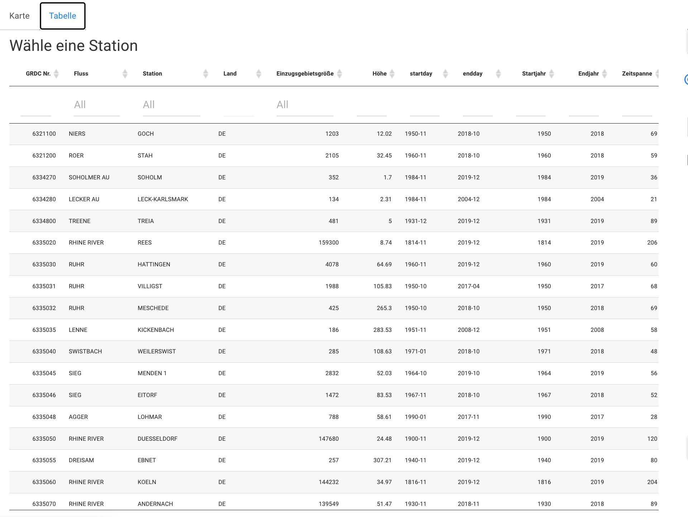
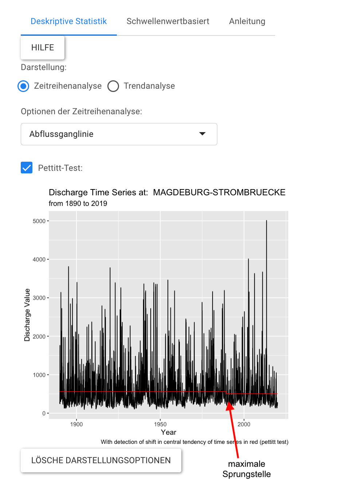
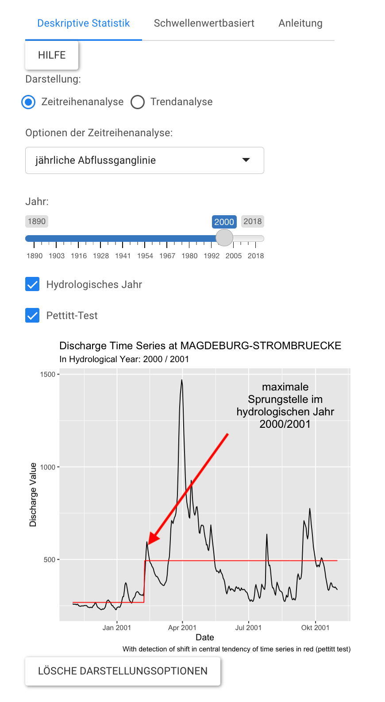
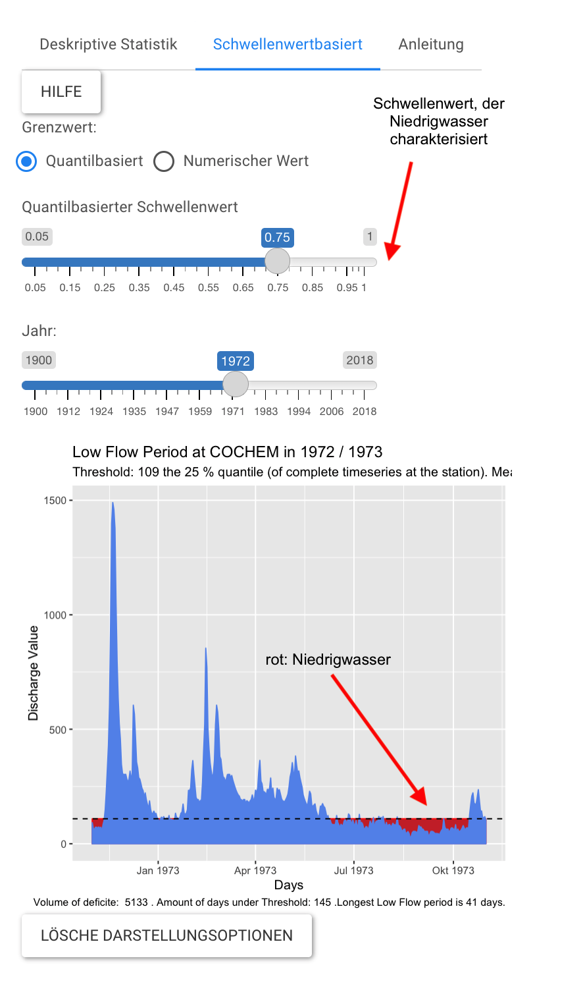
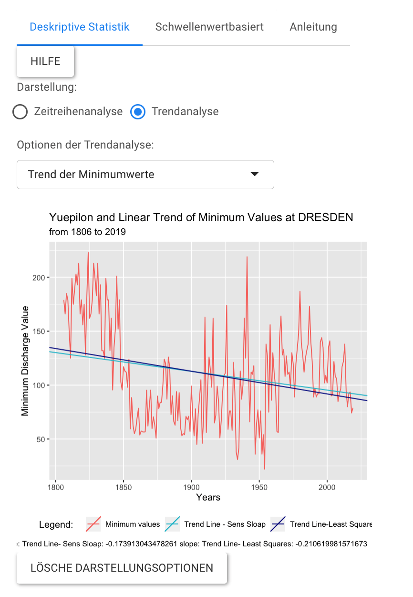
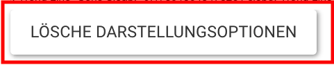

#### Auswahl der Station

Der Tab **"Messstationen"** dient der Analyse der Zeitreihen einzelner Stationen. Die Wahl der Messstation erfolgt mittels der vorliegenden Karte oder der Tabelle. Während die Karte (LeafletMap, Cheng, Karambelkar, and Xie (2021))  verdeutlicht, welche Messstationen in dieser Analyse als [repräsentativ](#repstat) eingestuft wurden, liefert die Tabelle (DT-Tabelle, Xie, Cheng, and Tan (2021))  alle Informationen des  Metadatensatzes. Aus diesem Grund ermöglicht die Darstellung der Metadaten in der Tabellenform die Suche oder Sortierung der Stationen nach bestimmten Merkmalen einer Messreihe oder einer Messstation. Der Metadatensatz enthält Informationen über die GRDC-Nummer, den Flussnamen, die Messstation, die Einzugsgebietsgröße, die Höhenlage, das Start- und Enjahr, sowie den Start- und den Endmonat,  die Länge der Messreihe, die Geografische Lage und den Status (repräsentativ/nicht repräsentativ).

    
     

#### Analyse

Nach der Wahl einer Station können verschiedene Analysen durchgeführt werden, deren Ergebnisdarstellung mit dem R-Paket: ggplot2 ( Wickham (2016)) erfolgt. Es gibt die Möglichkeit, die gesamte Abflussganglinie einer Station darzustellen, oder ein bestimmtes hydrologisches Jahr auszuwählen. Mit Hilfe des Pettit-Tests (Pettitt (1979))  kann die maximale Sprungstelle innerhalb des gewählten Datensatzes ermittelt (Pohlert (2020)) werden, da Sprungstellen die Größe des ermittelten Trends beeinflussen (Oestermann and Mudersbach (2021)).

    
     

Die Datensätze können auch mit Hilfe einer Boxplotdarstellung hinsichtlich ihrer Verteilung untersucht werden. Auch ein Vergleich der Abflussganglinien einzelner Jahreszeiten oder Zeitabschnitte verschiedener Jahre ist möglich. Diese Darstellung soll zum Verständnis der Entwicklung und der Auswirkungen hydrologischer Extremjahre beitragen, denn sie ermöglicht beispielsweise den Zeitpunkt des abnehmenden Abflusses an einer Station über mehrere Jahre hinweg zu vergleichen. Neben diesen deskriptiven Ansätzen, ist auch die Berechnung verschiedener Niedrigwasserkennwerte für einzelne Messstationen möglich.

Für die **schwellenwertbasierte Niedrigwasseranalyse** einzelner Datensätze bietet die Website sowohl die Möglichkeit individuell den Schwellenwert zu wählen, oder ihn quantilbasiert zu berechnen. Außerdem lässt sich das hydrologische Jahr der Analyse auswählen. Das Ergebnis dieser Auswahl ist eine Grafik, in der die durch den Schwellenwert definierten Niedrigwasserperioden dargestellt werden. 

    

Für die **nicht schwellenwertbasierten Niedrigwasserkennwerte** werden die Trends sowohl mit der linearen Regression  (R Core Team (2021)) als auch mit dem Sen-Slope-Estimator (Bronaugh and Pacific Climate Impacts Consortium (2019)) berechnet. Dafür wird zunächst der Kennwert für jedes hydrologische Jahr seit dem Beginn der Messungen bestimmt und im Anschluss ein Trend aus diesen Werten berechnet. Zur Auswahl steht die Berechnung der NM$_x$Q-Werte, der Mittelwerte und der Minimumwerte . Sowohl für die NM$_x$Q-Analyse, als auch für die Mittelwertanalyse kann entweder eine bestimmte Jahreszeit oder das gesamte hydrologische Jahr betrachtet werden. Entsprechend dieser Auswahl erfolgt die Trendbestimmung ausschließlich auf der Grundlage der Daten einer Jahreszeit. Für die Berechnung des Trends der NM$_x$Q- Werte kann individuell ein x-Wert zwischen 0 und 90 gewählt werden, wobei die Auswahl an den gwählten Zeitrahmen angepasst werden sollte. 

    

#### Stabilität der Website

Um die Stabilität zu der Anwendung zu garantieren, bitte auf "Lösche Darstellungsoptionen" klicken, bevor ein neuer Datensatz oder eine neue Analyse ausgewählt wird. 

    

#### Repräsentative Stationen  

Im Rahmen dieser Arbeit wurden 21 <a name="repstat">repräsentative Stationen</a> Deutschlandweit ausgewählt, um die Ergebnisinterpretation zu vereinfachen. Die Auswahl der repräsentativen Stationen erfolgte Anhand der Art der Messung, der Länge der Zeitreihe, der geografischen Lage,  der verschiedenen Speisungsart und des zugehörigen Flusses der jeweiligen Messtation. Diese Vorauswahl soll es NutzerInnen von dieser Website ermöglichen, auch ohne Vorkenntnisse über verschiedene Messtationen aussagekräftige Messreihen zu finden und zu analysieren. Inwiefern diese Messstationen auch repräsenatativ für die umliegenden Einzugsgebiete sind, kann interaktiv mit Hilfe von dieser Website überprüft werden. Diese Auswahl ist ein Ansatz der möglicherweise die Analyse vereinfachen kann, erhebt jedoch keinen Anspruch auf Vollständigkeit. Selbstverständlich ist jede Station repräsentativ, was eine gewisse Lage, Einzugsgebietsgröße und Länge der Messreihe angeht, für einen möglichst vollständigen und ganzheitlichen Ansatz empfiehlt sich trotz der Vorauswahl die maximale Anzahl an Stationen auszuwerten. 

##### Quellen

Bronaugh, David, and Arelia Werner for the Pacific Climate Impacts Consortium. 2019. Zyp: Zhang + Yue-Pilon Trends Package. https://CRAN.R-project.org/package=zyp.

Cheng, Joe, Bhaskar Karambelkar, and Yihui Xie. 2021. Leaflet: Create Interactive Web Maps with the Javascript ’Leaflet’ Library. https://CRAN.R-project.org/package=leaflet.

Oestermann, Florian, and Christoph Mudersbach. 2021. “Langjährige Trends Der Niedrigwasserkennwerte in Deutschland.” Hydrologie Und Wasserbewirtschaftung 65: 137–55.

Pettitt, Anthony N. 1979. “A Non-Parametric Approach to the Change-Point Problem.” Journal of the Royal Statistical Society: Series C (Applied Statistics) 28 (2): 126–35.

Pohlert, Thorsten. 2020. Trend: Non-Parametric Trend Tests and Change-Point Detection. https://CRAN.R-project.org/package=trend.

R Core Team. 2021. R: A Language and Environment for Statistical Computing. Vienna, Austria: R Foundation for Statistical Computing. https://www.R-project.org/.

Wickham, Hadley. 2016. Ggplot2: Elegant Graphics for Data Analysis. Springer-Verlag New York. https://ggplot2.tidyverse.org.

Xie, Yihui, Joe Cheng, and Xianying Tan. 2021. DT: A Wrapper of the Javascript Library ’Datatables’. https://CRAN.R-project.org/package=DT.
