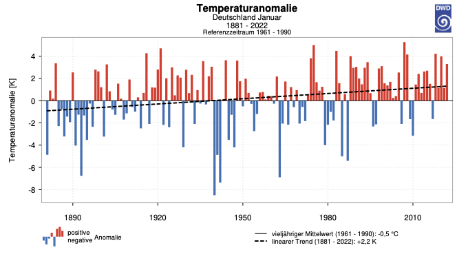

#### Einführung und Relevanz des Themas 

Auf globaler Skala lagen die  10 wärmsten Jahre seit dem Beginn der Aufzeichnungen im 21. Jahrhundert (“Climate at a Glance. Global Time Series” (2021)). Mit Blick auf Deutschland fällt auf, dass die Jahresdurschnittstemperatur hier zwischen 1951 und 2015 in jeder Dekade um 0,25°C gestiegten ist und dass die Temperatur hier schon heute 1,6°C über dem Referenzzeitraum seit dem Beginn der Messungen 1881 im Jahr 1881 liegt (Kahlenborn et al. (2021)).
 Diese Klimaänderung erhöht die Eintrittswahrscheinlichkeit und die Intensität klimatischer Extremereignisse, wie beispielsweise Trockenperioden (Bazaz et al. (2018)). Besonderen Anlass für die Analyse der deutschlandweiten Abflusstrends boten die hydrologischen  Extremjahre 2018 und 2019. Generell unterscheiden sich die durch Extremjahre verursachten Schäden regional, in Abhängigkeit von dem Wasserdargebot, der Verdunstungsrate und der Boden- sowie Vegetationsbeschaffenheit im Untersuchungsgebiet (MLUK (2021)). 
Klimamodellierungen haben ergeben, dass unabhängig von dem betrachteten Emissionsszenario die Mitteltemperatur Deutschlands jeder Jahreszeit weiter steigen wird (Kahlenborn et al. (2021)), weswegen von einer weiteren Verschärfung dieser Situation auszugehen ist. Die entstehenden Kosten, Risiken und die Erkenntnis, dass im Rahmen des Klimawandels eine Zunahme dieser Wetterextreme zu erwarten ist, unterstreicht die Dringlichkeit und die Relevanz der Thematik. Um sich den zukünftigen klimatischen Entwicklungen anzupassen und so in der Lage zu sein die möglichen Kosten und Risiken von Trockenzeiten zu verringern, ist es unabdinglich mögliche Entwicklungen quantifizieren zu können. Das Ziel dieser Arbeit ist die Visualisierung und Einordnung von vergangenen Niedrigwasserentwicklungen in Deutschland, um mögliche regionale oder gewässerspezifische Entwicklungen darzustellen. 

#### Ziel dieser Website

Die Visualisierung verschiedener Niedrigwassertrends- und Kennwerte, erfolgt mit Hilfe dieser Website. Diese Analyseumgebung soll als eine interaktive Möglichkeit dienen, langjährige Abflussganglinien und sich abzeichnende Trends darstellen zu können. Darüber hinaus soll sie zukünftige Analysen erleichtern und den umfangreichen GRDC-Datensatz für 335 Stationen deutschlandweit nachvollziehbar, interaktiv und mit Hilfe von  Niedrigwasserstatistiken sowie einer Auswahl an repräsentativen Stationen für Jede_n Interessierte_n zugänglich machen.

**Mit dem Wissen über stetig steigende Verdunstungsraten durch steigende Mitteltemperaturen stellt sich die aktuelle Frage, ob deutschlandweit oder regionsspezifisch eine Zunahme von Niedrigwasserperoden in der Vergangenheit beobachtet werden konnte.**

#### Niedrigwasser und Abfluss 

Nach der DIN 4049-3 bezeichnet der Begriff "Abfluss" das Wasser, dass sich unter dem Einfluss der Schwerkraft sowohl über als auch unter der Erdoberfläche bewegt. Der Abfluss (Q) lässt sich mit Hilfe des Prinzips der Massenerhaltung bestimmen und entspricht dem Wasservolumen (V), das in einer Zeiteinheit (t), mit der Geschwindigkeit (v) die Querschnitssfläche eines Fließgewässers (A) durchfließt (Fohrer et al. (2016)).

Der oberirdische Abfluss ist die wichtigste Grundlage für wasserwirtschaftliche Planungsmaßnahmen, da dieser die am leichtesten und am genausten zu bestimmende Größe der Wasserbilanzgleichung eines Einzugsgebiets ist. Er steht in einer wechselseitigen Beziehung zu allen wasserführenden Komponenten des Einzugsgebietes wie den Bodenschichten und angrenzenden Gewässersystemen. Er wird primär bedingt durch den Niederschlag, die Schneeschmelze und die Verdunstungsrate (Bernhardt et al. (1993)).

Niedrigwasser ist ein saisonales, natürliches und regelmäßig auftretendes Phänomen (Smakhtin (2001)) und ist genau wie das Hochwasser ein Teil des natürlichen Abflussregimes.  Niedrigwasser wird definiert, als  "ein Zustand in einem oberirdischen Gewässer, bei dem der Wasserstand oder der Durchfluss einen bestimmten Wert (Schwellenwert) unterschritten hat" (MLUK (2021)). 
Dieser Schwellenwert kann regionsspezifisch, gewässerspezifisch oder anwendungsspezifisch gewählt werden.

In Abhängigkeit der Art der Speisung des Gewässers treten regional unterschiedliche Saisonalitäten auf. Ist das Abflussregime stark von der Schneelschmelze beeinflusst, so treten oftmals winterliche Niedrigwasser auf, da in dieser Jahreszeit der Niederschlag in der Schneedecke gespeichert ist (Fohrer et al. (2016)). Oder er wird als Eis in Gletschern über längere Zeiträume gespeichert  (Belz et al. (2007)). Ist das betroffene Einzugsgebiet in erster Linie ozeanisch geprägt, treten Niedrigwasserperioden vermehrt im Sommer auf, da hier die hohen Verdunstungsraten zu einer Zehrung der Wasserspeicher der Landschaft führen (Fohrer et al. (2016)). Die meisten  Niedrigwassersituationen treten in Deutschland für gewöhnlich in den Sommermonaten auf (Wilke (2021)).

Halten die zu Niedrigwasser führenden meteorologischen Bedingungen verhältnismäßig lange an, treten großräumig auf und sind die Speicher des Einzugsgebiets erschöpft, so stellt sich eine Dürre ein (Fohrer et al. (2016)). Das durch Niedrigwasser im Oberflächenabfluss beschriebene Extremereignis wird als hydrologische Dürre bezeichnet  (Riedel et al. (2021)).

#### Verschärfung der Niedrigwassersituation

Niedrigwasser wird sowohl durch natürliche, als auch durch anthropogene Einflussfaktoren verschärft. Natürliche Einflussfaktoren sind beispielsweise die Infiltrationseigenschaften der Böden und deren räumliche Verteilung, die Vegetationsbedeckung und die klimatischen Bedingunngen im Einzugsgebiet. Außerdem von Relevanz sind die hydraulischen Eigenschaften der Grundwasserleiter und die Topographie. In machen Regionen verschärfen darüber hinaus Permafrostbildung und Sohlenverluste die Niedrigwassersitaution (Smakhtin (2001)). 

Darüber hinaus können anthropogene Eingriffe in das Einzugsgebiet das natürliche, hydrologische System stark beeinflussen und somit zu Niedrigwassersituationen beitragen und darüber hinaus die Resilienz des Standortes gegenüber extremen Wetterlagen reduzieren. So verändern Eingriffe in die Vegetation beispielsweise die örtlichen Evapotranspirationseigenschaften und künstliche Entwässerungen oder Eingriffe in den Flusslauf beeinflussen die Rückhalte- und Speichereigenschaften des Einzugsgebietes (Smakhtin (2001)). Auch die steigenden Jahresmitteltemperaturen sorgen für eine Verschärfung der Niedrigwassersituation.  Betrachtet man den Zeitraum zwischen 1951 und 2015 so steigt die für Deutschland gemittelte Lufttemperatur in jeder Dekade um 0,25°C an. Eine erhebliche Zunahme der Jahresmitteltemperatur wird ab 1980 beobachtet (Kahlenborn et al. (2021)). 

     
    
 [Abb:Jahresdurchschnittstemperaturen in Deutschland im Beobachtungszeitraum 1881 bis 2022, dargestellt als Anomalien vom Bezugszeitraum (1971 bis 2000), basierend auf HYRAS-TAS. Blaue Balken sind negative Anomalien und rote Balken positive Anomalien. Die schwarze Linie zeigt den vieljährigen Mittelwert (1971 bis 2000), die gestrichelte Linie den linearen Trend. Quelle: www.DWD.de/zeitreihen]

    
    
    
    
    

Umso geringer der Wasserstand ist, desto höher ist der Einfluss von erhöhten Lufttemperaturen und Strahlungsintensitäten auf die Wassertemperatur. Diese höhere Temperatur führt bei gleichbleibenden Stofffrachten zu einer abnehmenden Sauerstoffkonzentration bei einer steigenden Nährstoffkonzentration (LAWA (2020)). Diese ökologischen Beeinträchtigungen führen unter anderem zum Artensterben und vestärken darüber hinaus den anthropogenen Klimawandel durch das Austrocknen von Mooren und anderen wassergesättigten Ökosystemen. Die erhöhte Trockenheit führt auch bei anderen Landökosystemen zur Beeinträchtigung der Lebensqualität und erhöhten CO2-Emissionen, wie beispielsweise durch vermehrt auftretende Waldbrände (MLUK (2021)). Demnach stellen Niedrigwasser einen positiven Rückkopplungsprozess im Klimawandel dar. Um Ernteausfälle zu Vermeiden wird die künstliche Bewässerung intensiviert, was ein weiteres anthropogen verursachtes Absinken des Grundwasserspiegels zur Folge hat (Kempf and Glaser (2020)). Diese erhöhte Nutzung führt zu einer Verstärkung der ökologischen Auswirkungen und verringert die Resilienz des Standortes gegenüber späteren Wetterextremen.  

Natürliche sowie anthropogene Faktoren haben in den letzten Jahren die Instationarität von Abflussregimen erhöht. Dennoch wird erwartet, dass Veränderungen der natürlichen Abflussregime sich unterschiedlich entwickeln, aufgrund der verschiedenenen Resilienzen der Einzugsgebiete  (Botter et al. (2013)).

#### Betrachtung des Abflussregimes in Deutschland 

Die Einzugsgebiete von Rhein, Donau, Elbe, Oder, Weser und Ems decken zusammen 93% der gesamten Ausdehnung der Bundesrepublik Deutschland ab. 90% der Einwohner Deutschlands leben im Einzugsgebiet einer dieser Flüsse, von denen jeder Teil des Bundeswasserstraßennetzes ist (Riedel et al. (2021)) 
 In den Flussgebieten der Elbe und der Oder ist der zum Oberflächenabfluss und zur Grundwasserneubildung beitragende Anteil des Niederschlags im Vergleich zum restlichen Teil Deutschlands sehr gering, während der Verdunstungsanteil bei rund 75% liegt (MLUK (2021)). Dieser vergleichsweise hohe Anteil wird durch die ausgedehnten Wasserflächen und die steigende Mitteltemperatur  bedingt. Durch die überwiegend sandigen Böden in Ostdeutschland reagiert diese Region sehr sensibel auf Niederschlagsdefizite (MLUK (2021)). Und generell liegen die  mittleren Niederschläge der neuen Bundesländer im langjährigen Durschnitt unter den mittleren Niederschlägen der alten Bundesländer. Die Situation wird durch die besonders niedrigen winterlichen Niederschlagssummen <200mm in Ost- und Nordostdeutschland weiter verschärft, da so die natürlichen Speicher des Wasserhaushalts über den Winter nicht ausreichend gefüllt werden können (Grünewald (2010)). In Kombination mit der durch die steigende deutsche Mitteltemperatur steigenden Evapotranspiration erhöhen diese Voraussetzungen die Eintrittswahrscheinlichkeiten hydrologischer Dürren (MLUK (2021)). Diese Gegebenheiten führen zu einem vergleichsweise "wasserarmen" Einzugsgebiet der Elbe (Grünewald (2010)). 

 Dahingegen begünstigen große Niederschlagsmengen und niedrige Verdunstungsraten im Alpenraum eine hohe Wasserverfügbarkeit in den Einzugsgebieten der Donau und des Rheins (Riedel et al. (2021)). In den Alpen dominiert ein nivales, durch Schneefall und Schneeschmelzen geprägtes, System. Charakteristisch für einen nival geprägten Abfluss ist eine steile Abflussspitze im Frühsommer und niedrige Werte im Winter (Belz et al. (2007)). Bedingt durch das Relief fließen an der Donau und am Oberlauf des Rheins 30% des Niederschlags oberflächlich ab, sodass das Risiko für Dürren hier geringer ist als im Flachland. Dem gegenüber stehen die Elbe und die Oder, die in Deutschland durch kein Mittelgebirge fließen, was zu einem geringen jährlichen Abfluss und zu einem erhöhten Niedrigwasserrisiko führt (Riedel et al. (2021)). Der Rhein beispielsweise ist sowohl pluvial als auch nival geprägt. Der pluviale Einfluss überlagert die nivale Prägung des Rheins flussabwärts. Die pluvial geprägten, großen Nebenflüsse wie die Mosel, der Main und der Neckar überprägen den nivalen Einfluss des Rheins. Im Zuge des Temperaturanstiegs wird weniger Niederschlag im Winter als Schnee zwischengespeichert, weswegen dieser schon in den Wintermonaten abfließt und daher im Sommer fehlt (Belz et al. (2007)).
 Das spätsommerliche Auftreten von Niedrigwasser in großen Flüssen, wie der Elbe und dem Rhein, wird in erster Linie durch Temperaturanomalien im vorhergehenden Frühjahr und Sommer hervorgerufen. Die übliche Niederschlagsmenge im April war in den Jahren zwischen 2007 und 2020 im Großteil Mitteleuropas durchschnittlich um 50% geringer, während die Temperaturen untypisch hoch waren.  Diese Wetterlagen wurden durch den abnehmenden Temperaturgradienten zwischen der arktischen Region und den mittleren Breiten begünstigt, die dazu führten, das atlantische Sturmzüge nach Norden abgelenkt wurden. Auch ein wiederkehrendes Hochdrucksystem über der Nordsee und Norddeutschland  begünstigte die lang anhaltenden, hohen Temperaturen (Ionita et al. (2020)).

#### Hydrologische Extremjahre: Deutschland in Europa 

Mitteleuropa hat innerhalb der letzten 14 Jahre eine Dürre erlebt, die sich in niedrigen Abflüssen, hohen Temperaturen, hohen Evapotranspirationsraten und niedrigen Bodenfeuchten äußerten (Ionita et al. (2020)). 
Eine mit der Periode 2014 bis 2018 vergleichbare Häufung von landwirtschaftlichen Dürren, die sich in erster Linie in einer geringen Bodenfeuchte während der Vegetationperiode äußern (Riedel et al. (2021)), ist in einer 254 jährigen Periode außergewöhnlich (Moravec et al. (2021)). 
Das volkwirtschaftliche Schadenspotential von Dürren resuliert aus der Dauer und der räumlichen Ausdehnung, da sie oft durch langanhaltende Großwetterlagen indiziert werden (Fohrer et al. (2016)).
Der Dürresommer im Jahr 2003 wurde als das gravierendste Dürrejahr innerhalb der letzten 500 Jahre bewertet (Schuldt et al. (2020)). Er war gekennzeichnet durch lang anhaltende, hohe Temperaturen und geringe Niederschläge aufgrund einer Reihe von großräumigen Hochdruckgebieten (Fohrer et al. (2016)). Die daraus resultierenden niedrigen Wasserstände in Flüssen und Seen, führten zu hohen Schäden durch Ausfälle in der Schifffahrt, Energieerzuegung und Landwirtschaft. Darüber hinaus litt insbesondere der ältere Teil der Bevölkerung unter Herzkreislaufproblemen. Insgesamt war Ostdeutschland am stärksten betroffen, wobei man nur bei wenigen Pegeln von Jahrhundertereignissen sprechen konnte   (Koehler et al. (2007)). Auch das Jahr 2011 war durch zwei Niedrigwassersituationen im Frühling und im Herbst gekennzeichnet und wies insgesamt eine sehr starke Saisonalität auf. Am stärksten war das Einzugsgebiet des Rheins, der Weser und der Donau betroffen (Kohn et al. (2014)).

Trotz des gravierenden Ausmaßes des Extremjahres 2003 ergaben Auswertungen, dass der Einfluss auf die Wälder in Deutschland, Österreich und der Schweiz im Jahr 2018 die Folgen von 2003 übertroffen hat. In dieser Region lag die Mitteltemperatur während der Vegetationsperiode ca. 3,3°C über dem langzeitlichen Mittel und 1,2°C über dem Mittel im Jahr 2000 (Schuldt et al. (2020)). Insgesamt war 2018 das Jahr mit den höchsten Temperaturen seit dem Beginn der regelmäßigen Temperaturaufzeichnungen. Diese Situation wurde durch das gemittelte Niederschlagsdefizit von 200mm verschärft (Meinert et al. (2019)).

Das Extremjahr 2018 führte dazu, dass auch die überdurchschnittlichen Regenfälle im Januar und März 2019 die Wasserspeicher in tieferen Schichten nicht vollständig auffüllen konnten. In Kombination mit der Hitzeperiode Ende Juni 2019 führten diese Voraussetzungen im Jahr 2019 zu einer erneuten Trockensituation. Dieses Extremjahr zeichnete sich in erster Linie durch den heißen Juni, als wärmsten Monat seit Beginn der Messungen und die dementsprechend hohen Raten der potentiellen Verdunstung aus, was großräumig zu einer negativen klimatischen Wasserbilanz führte (Meinert et al. (2019)).

Insbesondere in Deutschland, Polen und der Tschechischen Republik sind schon die Folgen der mehrjährigen Dürre ersichtlich. Demnach verkraften Ökosysteme einjährige Dürren, während mehrjährige Dürreperioden ihre Funktionen deutlich beeinträchtigen (Moravec et al. (2021)).
Hydrologische Modelle bilden die Effekte des Klimawandels auf das tatsächliche Abflussverhalten von Fließgewässern ab. Mehr als 90% dieser Modelle prognostiszieren einen Rückgang der Anzahl der Sommertage mit Niederschlag (Riedel et al. (2021)), wodurch das Risiko mehrjähriger Dürreperioden zunimmt. Ist diese länger andauernde Entwicklung in den Abflusstrends Deutschlands zu erkennen?

##### Quellen 

Belz, Jörg Uwe, Gerhard Brahmer, Hendrik Buiteveld, H Engel, R Grabher, H Hodel, P Krahe, et al. 2007. Das Abflussregime Des Rheins Und Seiner Nebenflüsse Im 20. Jahrhundert: Analyse, Veränderungen, Trends. Internationale Kommission für die Hydrologie des Rheingebietes Lelystad, The ….

Botter, Gianluca, Stefano Basso, Ignacio Rodriguez-Iturbe, and Andrea Rinaldo. 2013. “Resilience of River Flow Regimes.” Proceedings of the National Academy of Sciences 110 (32): 12925–30. https://doi.org/10.1073/pnas.1311920110.

Grünewald, Uwe. 2010. “Wasserbilanzen Der Region Berlin-Brandenburg.”

Ionita, Monica, Viorica Nagavciuc, R Kumar, and O Rakovec. 2020. “On the Curious Case of the Recent Decade, Mid-Spring Precipitation Deficit in Central Europe.” Npj Climate and Atmospheric Science 3 (1): 1–10.

Kempf, Michael, and Rüdiger Glaser. 2020. “Tracing Real-Time Transnational Hydrologic Sensitivity and Crop Irrigation in the Upper Rhine Area over the Exceptional Drought Episode 2018–2020 Using Open Source Sentinel-2 Data.” Water 12 (12). https://doi.org/10.3390/w12123298.

Koehler, G, M. Schwab, W Finke, and J. U. Belz. 2007. “Überblick Zur Niedrigwasserperiode 2003 in Deutschland: Ursachen – Wirkungen – Folgen. – Hydrologie Und Wasserbewirtschaftung.” HyWa. https://www.hywa-online.de/ueberblick-zur-niedrigwasserperiode-2003-in-deutschland-ursachen-wirkungen-folgen/.

Kohn, Irene, Klemens Rosin, Daphné Freudiger, Jörg Uwe Belz, Kerstin Stahl, and Markus Weiler. 2014. “Niedrigwasser in Deutschland 2011.” Hydrol. Wasserbewirts 58 (1): 4–17.

LAWA. 2020. “LAWA (2020): Auswirkungen Des Klimawandels Auf Die Wasserwirtschaft – Bestandsaufnahme, Handlungsoptionen Und Strategische Handlungsfelder 2020.” Bund/Länder-Arbeitsgemeinschaft Wasser (LAWA).

Meinert, T, A Becker, P Bissolli, J Daßler, N Breidenbach, and M Ziese. 2019. “Ursachen Und Folgen Der Trockenheit in Deutschland Und Europa Ab Juni 2019.” Offenbach: Deutscher Wetterdienst.

Moravec, Vojtěch, Yannis Markonis, Oldrich Rakovec, Miroslav Svoboda, Miroslav Trnka, Rohini Kumar, and Martin Hanel. 2021. “Europe Under Multi-Year Droughts: How Severe Was the 2014–2018 Drought Period?” Environmental Research Letters 16 (3): 034062.

Riedel, Thomas, Christoph Nolte, Tim aus der Beek, and Jana Liedtke. 2021. “Niedrigwasser, Dürre Und Grundwasserneubildung – Bestandsaufnahme Zur Gegenwärtigen Situation in Deutschland, Den Klimaprojektionen Und Den Existierenden Maßnahmen Und Strategien.” Umweltbundesamt. https://www.umweltbundesamt.de/sites/default/files/medien/1410/publikationen/2022-01-17_texte_174-2021_niedrigwasser_duerre_und_grundwasserneubildung.pdf.

Schuldt, Bernhard, Allan Buras, Matthias Arend, Yann Vitasse, Carl Beierkuhnlein, Alexander Damm, Mana Gharun, et al. 2020. “A First Assessment of the Impact of the Extreme 2018 Summer Drought on Central European Forests.” Basic and Applied Ecology 45: 86–103.
