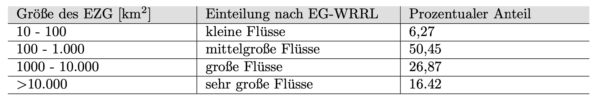
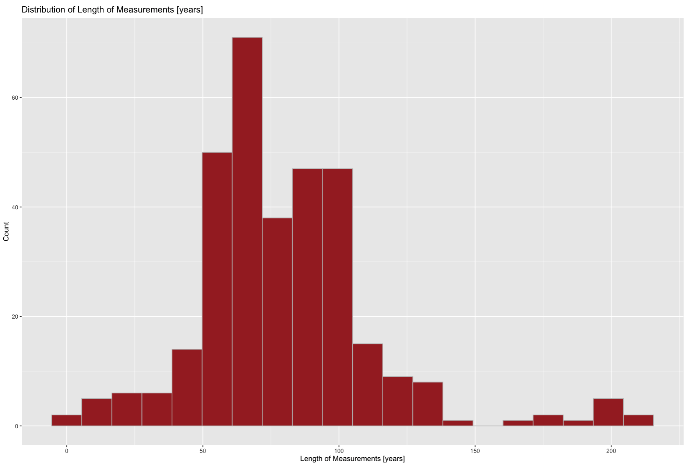
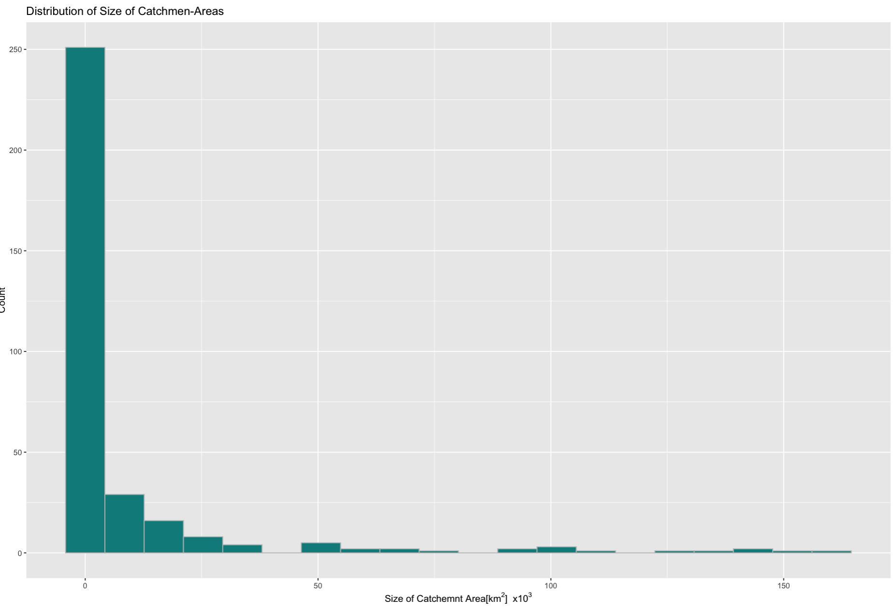
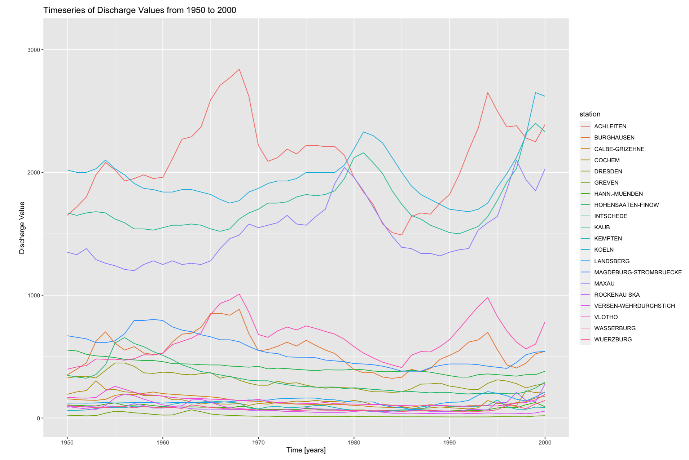
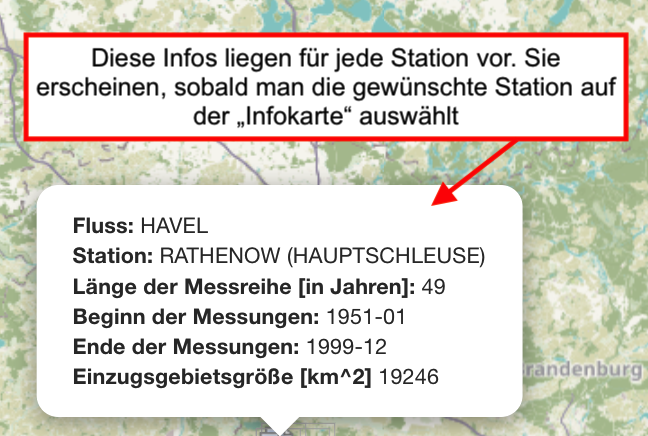

#### Der GRDC-Datensatz

Der verwendete Datensatz wird vom Global Runoff Data Centre (GRDC) zur Verfügung gestellt (GRDC (2021)).

Das Ziel dieser Organisation ist die Unterstützung der Erforschunng globaler klimatologischer und hydrologischer Veränderungen. Das GRDC steht unter der Schirmherrschaft der WMO, der Weltorganisation der Meteorologie. Der Datensatz umfasst täglich oder monatlich gemittelte Abflusswerte  für über 10 000 Stationen in 159 Ländern (BFG (2020)).  Der Abfluss wird in Kubikmetern pro Sekunde angegeben. Für diese Analyse wurden ausschließlich Datensätze mit täglich gemittelten Abflusswerten verwendet. Diese Analyse fokussiert sich ausschließlich auf die in Deutschland liegenden Stationen. Zum Zeitpunkt der Datenanalyse (2021) enthält der Datensatz Einträge für 330 Messstationen, an insgesamt 204 Flüssen in Deutschland. Da zum Zeitpunkt des Datenzugriffs lediglich 2 Stationen über Messdaten bis (März) 2020 verfügten, beschränkt sich die deutschlandweite Datenauswertung auf den Zeitraum zwischen November 1820 und Oktober 2019. Durch die dauerhafte Aktualisierung des Datensatzes ist auch eine laufende Anpassung der Analyse sowie eine Aktualisierung der Analyseumgebung möglich. 

Die EG-Wasserrahmenrichtline 2000/60/EG, hat eine Einteilung der Flüsse nach der Größer Ihrer einzugsgebiete vorgenommen. Demnach gibt die Auswertung des Datensatzes in erster Linie Auskunft über die Entwicklung des Abflussverhaltens an Messpegeln mittelgroßer und großer Flüsse:

     

#### Übersicht

Die Auswahl "Der Datensatz in Zahlen" bietet die Möglichkeit die Längen der Messreihen und die Größen der Einzugsgebiete in einer Dichteverteilung einzuordnen.

     
         

Es ist außerdem möglich, die Zeitreihen aller "repräsentativen Stationen" parallel zu visualisieren, um einen Überblick über die Größenor   dnung zu erhalten. 

     

- Weitere Metainformationen über den GRDC-Datensatz sind dem Metadatensatz in der Tabelle (Tab: **"Stationsanalyse"**) zu entnehmen

#### Die Infokarte 

Mehr Informationen über jede Station sind den "Popup-Fenstern" zu entnehmen:

     

##### Quellen 

BFG. 2020. “Welcome to the Global Runoff Data Centre.” The Global Runoff Data Centre, 56068 Koblenz, Germany. https://www.bafg.de/GRDC/EN/Home/homepage_node.html.

GRDC. 2021. “GRDC Data Download.” The Global Runoff Data Centre, 56068 Koblenz, Germany. https://www.bafg.de/GRDC/EN/02_srvcs/21_tmsrs/210_prtl/tou.html?nn=2862854.

