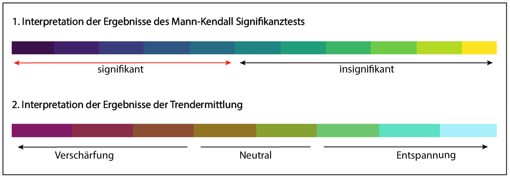

#### Ziel der Seite

Die Generierung einer Karte (LeafletMap,Cheng, Karambelkar, and Xie (2021)), die sowohl Trends, als auch Signifikanzen für bestimmte Niedrigwasserkennwerte deutschlandweit darstellt:

     
    
1940 bis 2019, Sommerliche Zyp-Trends der Mittelwerte

Die Karte kann für vier verschiedene, sowohl schwellenwertbasierte, als auch nicht schwellenwertbasierte, Kennwerte generiert werden. So ist eine flächendeckende Analyse der Trends der Abflussmittelwerte, der NM7Q-Werte, der maximalen Niedrigwasserperioden und der Summe der Tage, an denen der mittlere Abfluss unter dem Niedrigwasser definierenden Schwellenwert liegt, möglich.

#### Optionen

Welche Stationen auf der Karte angezeigt werden, ist abhängig von der individuellen Auswahl. In erster Linie limitiert die Wahl des Zeitrahmens die Menge der vorliegenden Stationen. Diese bedingt, dass aus dem deutschlandweiten Datensatz ausschließlich die Stationen gefiltert werden, deren Messreihen mindestens den gewählten Zeitrahmen abdecken.

Außerdem besteht die Möglichkeit ausschließlich die in dieser Arbeit als repräsentativ bewerteten Stationen auszuwählen. Neben dem hydrologischen Jahr, kann wieder eine bestimmte Jahreszeit innerhalb des hydrologischen Jahres ausgewählt werden. Es wird sowohl ein Trend mit der Linearen Regression (R Core Team (2021)), als auch ein Trend mit dem Sen-Slope Estimator (Bronaugh and Pacific Climate Impacts Consortium (2019)) bestimmt. Die Legende der Trendanalysen zeigt die Geradensteigung des berechneten, linearen Modells, also den Trend. Dabei signalisiert braun/lila eine Verschärfung - und  grün/blau eine Entspannung der Niedrigwassersituation:

     
    
Legendeninterpretation für die deutschlandweiten Trends

Um die Signifikanz des robusten Sen-Slope Trends bewerten zu können, ist es möglich, die P-Werte des Mann-Kendall Tests (McLeod (2011)) zu visualisieren, um einzuschätzen, ob der Sen-Slope Trend signifikant ist. Umso kleiner dieser ist, desto höher ist die Wahrscheinlichkeit für den gegebenen Datensatz, dass die Alternativhypothese H(A) zutrifft. Die Alternativhypothese nimmt an, dass ein Trend vorliegt. Der Test wurde zweiseitig durchgeführt. Für diese Analyse wurde das Signifikanzniveau von 0,05 angenommen. Für die Ergebnisinterpretation bedeutet das, dass der Trend für einen P-Wert bis 0,05 signifikant ist.

#### Achtung!

Da der Mann-Kendall Test ausschließlich auf die Ergebnisse des Sen-Slope Estimators Bronaugh and Pacific Climate Impacts Consortium (2019)) angewendet wurde, beziehen sich die Aussagen über signifikante Trends ausschließlich auf die "zyp"/Sen-Slope-Trends. 

     
    
Signifikanzen der sommerlichen Mittelwerte

- Die Ergebnisse der nicht schwellenwert basierten Kennwerte (MQ-Mittlerer Abfluss & NM7Q) wurden normiert. Dafür wurde der **spezifische Abfluss** berechnet, der Trendwert wurde auf die Größe des Einzugsgebiets bezogen. 
- Für die schwellenwertbasierten Kennwerte (Summe der Tage unter Q , maximale Niedrigwasserperiode) war keine Normierung notwendig, da alle Schwellenwerte quantilbasiert ermittelt wurden, was in diesem Fall einer Normierung entspricht
- Mehr Informationen zu der Trendermittlung, den Kennwerten und der Normierung: unter **Methoden**

##### Quellen
Bronaugh, David, and Arelia Werner for the Pacific Climate Impacts Consortium. 2019. Zyp: Zhang + Yue-Pilon Trends Package. https://CRAN.R-project.org/package=zyp.

Cheng, Joe, Bhaskar Karambelkar, and Yihui Xie. 2021. Leaflet: Create Interactive Web Maps with the Javascript ’Leaflet’ Library. https://CRAN.R-project.org/package=leaflet.

McLeod, A. I. 2011. Kendall: Kendall Rank Correlation and Mann-Kendall Trend Test. https://CRAN.R-project.org/package=Kendall.

R Core Team. 2021. R: A Language and Environment for Statistical Computing. Vienna, Austria: R Foundation for Statistical Computing. https://www.R-project.org/.